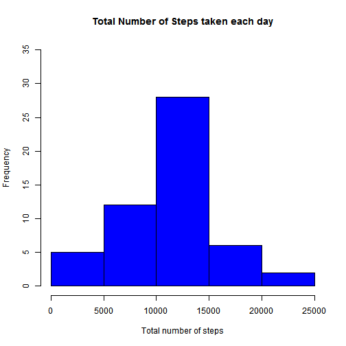
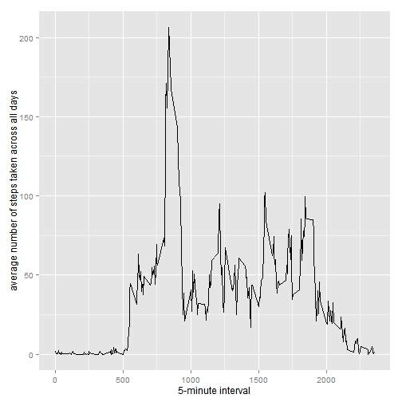
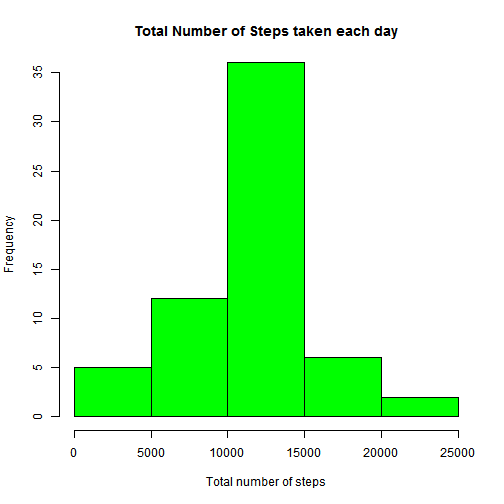
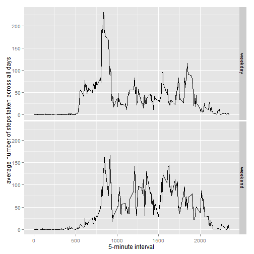

## Reproducible Research Peer Assessment 1 

#### Dataset  
Dataset : Activity monitoring data -> repdata_data_activity.zip uncompressed into activity.csv     
Downloaded from : Course website (2nd Dec 2014)  
Contents :  
The variables included in this dataset are:  
- steps: Number of steps taking in a 5-minute interval (missing values are coded as NA which should number 2,304.)  
- date: The date on which the measurement was taken in YYYY-MM-DD format  
- interval: Identifier for the 5-minute interval in which measurement was taken  
The dataset is stored in a comma-separated-value (CSV) file and there are a total of 17,568 observations in this 
dataset.  

#### Loading and preprocessing the data  


```r
## Assessment_1.Rmd and source activity.csv are stored in the same working folder assessment_1
## Uncompress and read in all data and correct the class of each column
alldata <- read.csv(unzip(zipfile = "repdata_data_activity.zip"),sep = ",",header = TRUE, 
           na.strings ="NA",colClasses = c('integer','Date','factor'))

## Get subset without NA (missing values)
removeNAdata <- na.exclude(alldata)
```

Dataset analysis : 


```r
# get summary of alldata
summary(alldata)
```

```
##      steps             date               interval    
##  Min.   :  0.00   Min.   :2012-10-01   0      :   61  
##  1st Qu.:  0.00   1st Qu.:2012-10-16   10     :   61  
##  Median :  0.00   Median :2012-10-31   100    :   61  
##  Mean   : 37.38   Mean   :2012-10-31   1000   :   61  
##  3rd Qu.: 12.00   3rd Qu.:2012-11-15   1005   :   61  
##  Max.   :806.00   Max.   :2012-11-30   1010   :   61  
##  NA's   :2304                          (Other):17202
```

```r
# get dim() of data
dim(alldata)
```

```
## [1] 17568     3
```

```r
# get summary of subset
summary(removeNAdata)
```

```
##      steps             date               interval    
##  Min.   :  0.00   Min.   :2012-10-02   0      :   53  
##  1st Qu.:  0.00   1st Qu.:2012-10-16   10     :   53  
##  Median :  0.00   Median :2012-10-29   100    :   53  
##  Mean   : 37.38   Mean   :2012-10-30   1000   :   53  
##  3rd Qu.: 12.00   3rd Qu.:2012-11-16   1005   :   53  
##  Max.   :806.00   Max.   :2012-11-29   1010   :   53  
##                                        (Other):14946
```

```r
dim(removeNAdata)
```

```
## [1] 15264     3
```

#### What is mean total number of steps taken per day?  

1. Make a histogram of the total number of steps taken each day  


```r
# get total steps taken each day
totalsteps <- tapply(removeNAdata$steps, removeNAdata$date, FUN = sum)

# draw histogram
hist(totalsteps, main="Total Number of Steps taken each day", ylim = c(0, 35), ylab = "Frequency", xlab = "Total number of steps", col="blue")
```

 

2.Calculate and report the mean and median total number of steps taken per day  


```r
# compute mean and median.

mean_totalsteps <- as.character(round(mean(totalsteps),digits=0))
median_totalsteps <- as.character(round(median(totalsteps),digits=0))
```

The mean total number of steps taken per day is 10766.  
The median total number of steps taken per day is 10765.  


#### What is the average daily activity pattern?  

1.  Make a time series plot (i.e. type = "l") of the 5-minute interval (x-axis) and the average number of steps taken, averaged across all days (y-axis)  
- compute averages  


```r
# get the average number of steps across all days by interval
aggsteps <- aggregate(removeNAdata$steps, list(interval = as.numeric(as.character(removeNAdata$interval))),mean)
# rename column for average number of steps
names(aggsteps)[2] <- "avgsteps"
```

- draw tine-series graph  

```r
library(ggplot2)
ggplot(data = aggsteps, aes(x = interval, y = avgsteps)) + geom_line() + xlab("5-minute interval") + 
    ylab("average number of steps taken across all days")
```

 

2. Which 5-minute interval, on average across all the days in the dataset, contains the maximum number of steps?  


```r
intervalmax <- which.max(round(aggsteps$avgsteps,digits=1))   
maxsteps <- round(aggsteps[intervalmax,]$avgsteps,digit=1)  
```
  
The 5-minute interval that contains the maximum number of steps in the dataset is interval 104 at an average of 206.2 steps.  


#### Imputing missing values  

1. Calculate and report the total number of missing values in the dataset (i.e. the total number of rows with NAs)  


```r
NAtotal <- sum(is.na(alldata))  
```

The number of rows with NAs is 2304  


2. Devise a strategy for filling in all of the missing values in the dataset. The strategy does not need to be sophisticated. For example, you could use the mean/median for that day, or the mean for that 5-minute interval, etc. 
3.  Create a new dataset that is equal to the original dataset but with the missing data filled in.  
- make a copy of the alldata dataset.  
- for each NA record, replace with the average value for that interval found in aggsteps.  


```r
imputedata <- alldata 

for (i in 1:nrow(imputedata)) 
    {
        if (is.na(imputedata$steps[i])) 
        {
              imputedata$steps[i] <- aggsteps[which(imputedata$interval[i] == aggsteps$interval), ]$avgsteps
        }
    }

# check total records in imputedata
summary(imputedata)
```

```
##      steps             date               interval    
##  Min.   :  0.00   Min.   :2012-10-01   0      :   61  
##  1st Qu.:  0.00   1st Qu.:2012-10-16   10     :   61  
##  Median :  0.00   Median :2012-10-31   100    :   61  
##  Mean   : 37.38   Mean   :2012-10-31   1000   :   61  
##  3rd Qu.: 27.00   3rd Qu.:2012-11-15   1005   :   61  
##  Max.   :806.00   Max.   :2012-11-30   1010   :   61  
##                                        (Other):17202
```

There is no more NA count compared to the Summary of alldata above.    

4. Make a histogram of the total number of steps taken each day and Calculate and report the mean and median total number of steps taken per day.


```r
# get total steps taken each day
newtotalsteps <- tapply(imputedata$steps, imputedata$date, FUN = sum)

# draw histogram
hist(newtotalsteps, main="Total Number of Steps taken each day", ylim = c(0, 35), ylab = "Frequency", xlab = "Total number of steps", col="green")
```

 

2.Calculate and report the mean and median total number of steps taken per day   
Do these values differ from the estimates from the first part of the assignment?  
What is the impact of imputing missing data on the estimates of the total daily number of steps?


```r
# compute mean and median.
newmean_totalsteps <- as.character(round(mean(newtotalsteps),digits=0))
newmedian_totalsteps <- as.character(round(median(newtotalsteps),digits=0))
```

The mean total number of steps taken per day is now 10766 compared to previous mean of 10766.  
The median total number of steps taken per day is not 10766 compared to previous median of 10765.  

While the mean remains the same the median has increased slightly 

#### Are there differences in activity patterns between weekdays and weekends?    
1.  Create a new factor variable in the dataset with two levels - "weekday" and "weekend" indicating whether a given date is a weekday or weekend day.  


```r
# derive day column in imputedata dataset using the Date column.
imputedata$weekdays <- factor(format(imputedata$date, "%A"))

# infer whether a day is weekday or weekend
levels(imputedata$weekdays) <- list(weekday = c("Monday", "Tuesday", "Wednesday", "Thursday", "Friday"),
                                    weekend = c("Saturday", "Sunday")) 
# show summary
summary(imputedata)
```

```
##      steps             date               interval        weekdays    
##  Min.   :  0.00   Min.   :2012-10-01   0      :   61   weekday:12960  
##  1st Qu.:  0.00   1st Qu.:2012-10-16   10     :   61   weekend: 4608  
##  Median :  0.00   Median :2012-10-31   100    :   61                  
##  Mean   : 37.38   Mean   :2012-10-31   1000   :   61                  
##  3rd Qu.: 27.00   3rd Qu.:2012-11-15   1005   :   61                  
##  Max.   :806.00   Max.   :2012-11-30   1010   :   61                  
##                                        (Other):17202
```

2.Make a panel plot containing a time series plot (i.e. type = "l") of the 5-minute interval (x-axis) and the average number of steps taken, averaged across all weekday days or weekend days (y-axis). See the README file in the GitHub repository to see an example of what this plot should look like using simulated data.  


```r
# compute average number of steps across all weekday days and weenend days
newaggsteps <- aggregate(imputedata$steps, list(interval = as.numeric(as.character(imputedata$interval)), weekdays =  imputedata$weekdays), mean)
               
# rename column for average number of stepsddd
names(newaggsteps)[3] <- "avgsteps"

# check newaggsteps
summary(newaggsteps)
```

```
##     interval         weekdays      avgsteps      
##  Min.   :   0.0   weekday:288   Min.   :  0.000  
##  1st Qu.: 588.8   weekend:288   1st Qu.:  2.047  
##  Median :1177.5                 Median : 28.133  
##  Mean   :1177.5                 Mean   : 38.988  
##  3rd Qu.:1766.2                 3rd Qu.: 61.263  
##  Max.   :2355.0                 Max.   :230.378
```

- draw tine-series graph  

```r
library(ggplot2)
ggplot(data = newaggsteps, aes(x = interval, y = avgsteps)) + geom_line() + facet_grid(weekdays ~ .) + xlab("5-minute interval") + ylab("average number of steps taken across all days")
```

 

There appears to be more steps taken during weekdays than during weekends. 

#####                                        ========= ~~ End of Report ~~ =========
